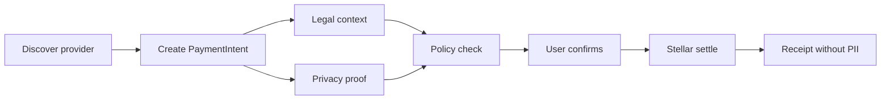
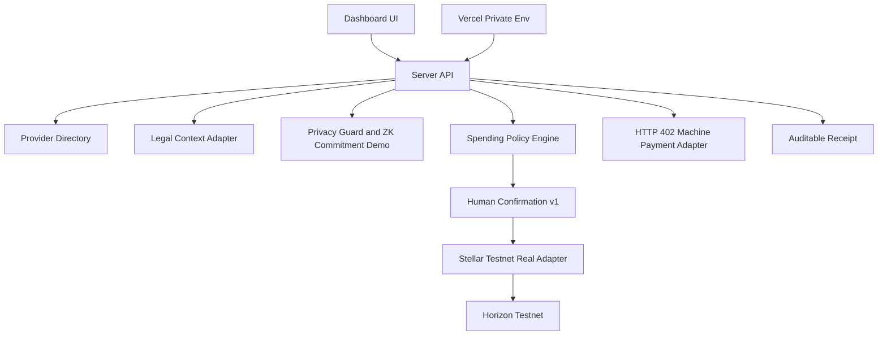

# Stellar Agent Spend Hub

**Privacy-first agentic payments on Stellar for MCP/API and digital-service spend.**

Stellar Agent Spend Hub lets an AI agent discover paid resources, prepare a payment intent, evaluate legal/privacy/policy rules, ask the user to confirm, settle through a Stellar-first rail, and leave an auditable receipt without exposing PII or secrets.

[Live demo](https://agente-pagos-stellar.vercel.app) | [First testnet transaction](https://horizon-testnet.stellar.org/transactions/4ebf30f6a9492f09739cbb5dd2710766f5a520097f2100e14e2918dd633d97bb) | [Docs](./docs/README.md)


## Why This Exists

Agents are starting to buy things: MCP tools, APIs, browser sessions, cloud credits, data, software, reservations, and later real-world bills. The hard part is not only moving money. It is controlling what the agent can do, proving why a payment happened, and keeping private identifiers out of receipts, memos, logs, and metadata.

The v1 wedge is **MCP/API payments** because it is universal, fast to demo, low-PII, and aligned with HTTP 402, x402, MPP, and agentic commerce. LatAm bill pay remains a major roadmap wedge, but only after stronger privacy/ZK and partner integrations.

## What Works Now

- Dashboard for Training Mode, Privacy Mode, Agent Spend, Machine Payments, and Portfolio Actions.
- Provider directory inspired by Stripe Directory, MPP, x402, Circle, Tempo, and agentic commerce patterns.
- Payment intents, policy checks, privacy checks, legal context checks, receipts, and idempotency.
- HTTP 402 machine-payment loop: challenge, prepare, approve, retry with credential.
- Privacy guard that blocks RUT, phone, email, account numbers, card data, API keys, and client secrets from public payloads.
- Demo ZK commitments/proofs for privacy-first bill-pay readiness.
- Stellar simulated rail for local flows plus a real Stellar testnet rail with guarded submit.
- Vercel server-side endpoint for one supervised tiny testnet payment, closed by default.

## First Verified Testnet Payment

The project has already executed one tiny payment from Vercel to Stellar testnet.

| Field | Value |
| --- | --- |
| Transaction hash | `4ebf30f6a9492f09739cbb5dd2710766f5a520097f2100e14e2918dd633d97bb` |
| Horizon | https://horizon-testnet.stellar.org/transactions/4ebf30f6a9492f09739cbb5dd2710766f5a520097f2100e14e2918dd633d97bb |
| Amount | `0.0000010 XLM` |
| Network | `stellar:testnet` |
| Rail | `Stellar Testnet Real Rail` |
| Finality | `submitted-testnet` |
| Source public key | `GDHVLS4D76CFR4OLJWFHYYKWC526QLTGADBNLUII5QG6XS2QM4VY4WC5` |
| Destination public key | `GAJHUKKQVK3OKUAAJ3GTE2U7BWSM4L7JY7CLMRFHJ4S2Z7HEN5L7NHPX` |

`STELLAR_SUBMIT_ENABLED` is back to `false` in production. Any new real testnet submit must be explicitly opened, deployed, executed once, closed, and redeployed.

## Product Flow



## Architecture



## Why Stellar

- Stellar is credible for stablecoin and low-cost payment rails.
- Testnet plus `@stellar/stellar-sdk` already produced a verifiable settlement hash.
- Soroban gives a path to smart wallets, session keys, limits, allowlists, and policy signer patterns.
- Stellar is a strong ecosystem fit for grants and LatAm utility.
- The product can remain Stellar-first while staying compatible with x402/MPP-style discovery and challenge flows.

## Why MCP/API First

- Easier to validate than IRL bill pay because it avoids RUT, customer numbers, addresses, and account identifiers.
- Better demo loop: an agent requests a resource, receives `402 Payment Required`, pays, retries, and gets the resource.
- Natural early buyers: MCP providers, API companies, AI infra tools, data providers, cloud/devtool vendors.
- Lets the project prove control, privacy, receipts, and settlement before entering regulated bill-pay workflows.

## Quickstart

```powershell
npm install
npm run qa
npm run dev
```

Open:

```text
http://localhost:4179
```

Useful commands:

```powershell
npm test
npm run smoke
npm run doctor
npm run agent:402 -- --provider browserbase-mcp --resource agent-client-smoke --amount 9
```

## Stellar Testnet

Dry-run readiness:

```powershell
npm run setup:testnet
npm run testnet:doctor
npm run testnet:payment
```

Supervised tiny submit, only during a controlled test window:

```powershell
$env:STELLAR_SUBMIT_ENABLED="true"
npm run testnet:payment -- --execute
$env:STELLAR_SUBMIT_ENABLED="false"
```

The default amount is `0.000001 XLM`. CLIs and receipts must never print `STELLAR_SECRET_KEY` or `TESTNET_PAYMENT_ADMIN_TOKEN`.

## Vercel Deploy

Project is linked to Vercel as `agente-pagos-stellar`.

```powershell
npm run qa
vercel build --prod
vercel deploy --prebuilt --prod --yes
```

Current production alias:

```text
https://agente-pagos-stellar.vercel.app
```

Secrets are stored only as Vercel environment variables. Do not commit `.env`, `.env.*`, `.vercel`, `data/runtime-state.json`, `public/`, logs, or secret outputs.

## Documentation

- [Docs index](./docs/README.md)
- [Current state](./docs/current-state.md)
- [Product](./docs/product.md)
- [Architecture](./docs/architecture.md)
- [Privacy and security](./docs/privacy-security.md)
- [Partner strategy](./docs/partner-strategy.md)
- [Sprint 02 testnet result](./docs/sprint-02-testnet-payment-result.md)
- [Sprint 03 smart wallet plan](./docs/sprint-03-smart-wallet-plan.md)
- [Roadmap](./docs/roadmap.md)
- [Pitch](./docs/pitch.md)

## V1 Rules

- User confirms every real payment.
- Autopilot is blocked in v1.
- The agent never receives private keys, card data, bank credentials, or raw bill-pay identifiers.
- Bill pay LatAm remains roadmap until the privacy layer and partnerships are stronger.
- DeFi actions stay simulated/blocked until contracts and strategy risks are reviewed.

## Current Scores

- MVP local/demo: `85/100`.
- Security/privacy v1: `76/100`.
- Machine payments HTTP 402: `78/100`.
- Documentation/GitHub readiness: `82/100`.
- Vercel deploy readiness: `92/100`.
- Stellar testnet path: `90/100`.
- Real testnet payment executed: `65/100`.
- Smart wallet readiness: `25/100`.