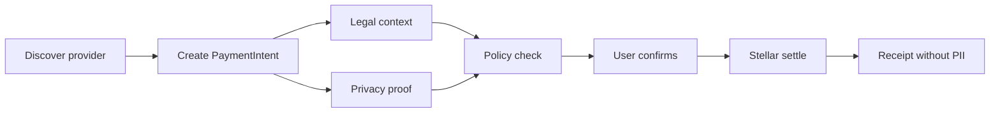
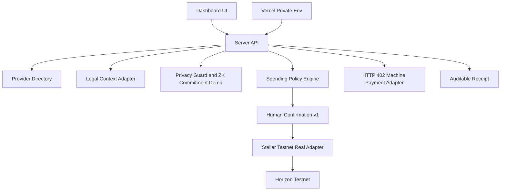

# Stellar Agent Spend Hub

**Privacy-first agentic payments on Stellar for MCP/API and digital-service spend.**

Stellar Agent Spend Hub lets an AI agent discover paid resources, prepare a payment intent, evaluate legal/privacy/policy rules, ask the user to confirm, settle through a Stellar-first rail, and leave an auditable receipt without exposing PII or secrets.

[Live demo](https://agente-pagos-stellar.vercel.app) | [First testnet transaction](https://horizon-testnet.stellar.org/transactions/4ebf30f6a9492f09739cbb5dd2710766f5a520097f2100e14e2918dd633d97bb) | [Docs](./docs/README.md)


## Why This Exists

Agents are starting to buy things: MCP tools, APIs, browser sessions, cloud credits, data, software, reservations, and later real-world bills. The hard part is not only moving money. It is controlling what the agent can do, proving why a payment happened, and keeping private identifiers out of receipts, memos, logs, and metadata.

The v1 wedge is **MCP/API payments** because it is universal, fast to demo, low-PII, and aligned with HTTP 402, x402, MPP, and agentic commerce. LatAm bill pay remains a major roadmap wedge, but only after stronger privacy/ZK and partner integrations.

## What Works Now

- Dashboard for Training Mode, Privacy Mode, Agent Spend, Machine Payments, and Portfolio Actions.
- Provider directory inspired by Stripe Directory, MPP, x402, Circle, Tempo, and agentic commerce patterns.
- Payment intents, policy checks, privacy checks, legal context checks, receipts, and idempotency.
- Official Stellar MPP Charge seller for a paid Stellar Risk API, plus a legacy HTTP 402 demo disabled in production.
- Privacy guard that blocks RUT, phone, email, account numbers, card data, API keys, and client secrets from public payloads.
- Demo ZK commitments/proofs for privacy-first bill-pay readiness.
- Stellar simulated rail for local flows plus a real Stellar testnet rail with guarded submit.
- Legacy Soroban policy contract deployed on testnet, plus Policy Escrow V2 compiled locally with strict destination/asset checks and cumulative session budgets.
- Vercel server-side endpoint for one supervised tiny testnet payment, closed by default.
- Contract Account V1 with WebAuthn owner, Ed25519 agent session, canonical relayer calls, fee cap and atomic replay protection.
- Public Evidence API with read-only Live/Replay modes and dependency diagnostics.
- Provider Kit V1 for official Stellar MPP Charge integrations in Node/MCP services.

## Sprint 09: MPP Charge + Policy Escrow V2

The repository now includes two deliberately separate proofs:

- An official Stellar MPP Charge seller charging `0.01 USDC` testnet for a real Horizon-backed transaction report.
- A Policy Escrow V2 contract enforcing per-payment and total session budgets before SAC transfers.

The local HTTP smoke test returned a valid `stellar/charge` challenge with `100000` USDC base units. Policy Escrow V2 passes `14/14` Rust tests and builds to Wasm hash `e69592e783afdbed768ed14fd1ad0d4d1f85cc7fbd6cb12a99f7ffec9a698d3c`.

Policy Escrow V2 is deployed at `CCNLNLFQ35CSO3QDTBXYKYGYIB4W7273AC7DTV653QOCOI46MPYZSQXH` with an active USDC-only session grant. The first real USDC payment and escrow transfer remain pending Circle Faucet funding and Vercel/Upstash setup. No mainnet or browser-held signing key is enabled.

[Sprint 09 status and runbook](./docs/sprint-09-mpp-escrow-v2.md)
## Sprint 10: Passkey Contract Account

`SpendAccountV1` implements `__check_auth` with two authorization paths: a WebAuthn/secp256r1 owner for grants and recovery, and an Ed25519 agent session restricted to the merchant, testnet USDC, `0.01 USDC` per payment, `0.02 USDC` total and 24-hour expiry.

The Wasm is installed on testnet with hash `6230e90601a82fd1afd8ae3dd59da55a4bc66d5e1fd4603996b1466f88c3c800`. [Verify the upload transaction](https://stellar.expert/explorer/testnet/tx/e03bcebf3ba684d4cff805cd2f990722e92c07881e159a13d93f6204b8aa8d80).

The merchant and relayer are deliberately separate. The relayer holds no USDC and can only pay network fees. Contract instance deployment waits for the production-domain passkey so the final owner credential is not a fixture.

[Sprint 10 status and acceptance gates](./docs/sprint-10-contract-account.md)

## Sprint 11-13: SCF Trust Demo + Provider Kit

The current grant-ready surface adds:

- `GET /api/evidence` with verified or explicitly pending testnet evidence.
- `GET /api/diagnostics/public` for sanitized Horizon, RPC and Upstash status.
- Live Evidence and Replay Demo modes that never sign or submit transactions.
- A validated `ProviderDefinition` and official MPP Provider Kit example.
- Threat model, 90-second demo script, partner shortlist and SCF milestones.

The coordinated MPP and Contract Account USDC receipts will appear automatically after the supervised testnet acceptance session. Until then, both remain `pending` with no transaction hash.

[Sprint status](./docs/sprint-11-13-status.md) | [Provider Kit](./docs/provider-kit.md) | [Threat model](./docs/threat-model.md) | [SCF package](./docs/scf-application.md) | [Demo script](./docs/demo-script.md)
## First Verified Testnet Payment

The project has already executed one tiny payment from Vercel to Stellar testnet.

| Field | Value |
| --- | --- |
| Transaction hash | `4ebf30f6a9492f09739cbb5dd2710766f5a520097f2100e14e2918dd633d97bb` |
| Horizon | https://horizon-testnet.stellar.org/transactions/4ebf30f6a9492f09739cbb5dd2710766f5a520097f2100e14e2918dd633d97bb |
| Amount | `0.0000010 XLM` |
| Network | `stellar:testnet` |
| Rail | `Stellar Testnet Real Rail` |
| Finality | `submitted-testnet` |
| Source public key | `GDHVLS4D76CFR4OLJWFHYYKWC526QLTGADBNLUII5QG6XS2QM4VY4WC5` |
| Destination public key | `GAJHUKKQVK3OKUAAJ3GTE2U7BWSM4L7JY7CLMRFHJ4S2Z7HEN5L7NHPX` |

`STELLAR_SUBMIT_ENABLED` is back to `false` in production. Any new real testnet submit must be explicitly opened, deployed, executed once, closed, and redeployed.

## Product Flow




## First Soroban Smart Wallet Testnet Contract

Sprint 05 deployed and invoked the permission wallet on Stellar testnet.

| Field | Value |
| --- | --- |
| Contract | `CAVI7DRQOWYNH2DD6DF53LXGCFEORVVEVWKZCCR3TCAHZLNRSQNONCYQ` |
| Lab | https://lab.stellar.org/r/testnet/contract/CAVI7DRQOWYNH2DD6DF53LXGCFEORVVEVWKZCCR3TCAHZLNRSQNONCYQ |
| Execute proof | https://stellar.expert/explorer/testnet/tx/c1d10a147ec9ad8c97f16675354eb8f8a7375c9aeba6a01d371402014d9aaf87 |
| Behavior | owner grant -> session signer execute -> public policy read |

Sprint 06 extends this proof toward native XLM SAC transfers behind the same permission layer.

## First SAC Transfer Behind Policy

Sprint 06 moved native XLM testnet through the Stellar Asset Contract from the smart wallet contract after owner/session, provider, destination, asset, limit, expiry and nonce checks passed.

| Field | Value |
| --- | --- |
| Smart wallet contract | `CDJEHJ763TTIVHD3MMFWIKO3R2K3A6MJKWZFZDU2L6LXXKEU43CDIGZU` |
| Native SAC | `CDLZFC3SYJYDZT7K67VZ75HPJVIEUVNIXF47ZG2FB2RMQQVU2HHGCYSC` |
| Transfer proof | https://stellar.expert/explorer/testnet/tx/8d9810cde8839895cd421756115df3de4b9f8e56f2460076a439b318e0b3ba7f |
| Behavior | pre-funded contract -> policy check -> SAC transfer -> TransferExecutedEvent |

This is still testnet-only and tiny; USDC/mainnet and bill pay remain out of scope.
## Guarded Runtime Settlement

Sprint 08 connected the backend payment lifecycle to the Soroban transfer path with admin auth, explicit submit gates, tiny limits, idempotency and safe receipts.

| Field | Value |
| --- | --- |
| Runtime proof | https://stellar.expert/explorer/testnet/tx/cb9bf9fcef3a79d045285b9c82a2633d8e78f36e9625fd6fb46ab799aae7152e |
| Horizon result | `successful: true`, ledger `3300195` |
| Receipt | `settled`, `soroban-testnet-submit`, nonce `3` |
| Safety | ephemeral admin token; submit gate closed after execution |
## Architecture



## Why Stellar

- Stellar is credible for stablecoin and low-cost payment rails.
- Testnet plus `@stellar/stellar-sdk` already produced a verifiable settlement hash.
- Soroban gives a path to smart wallets, session keys, limits, allowlists, and policy signer patterns.
- Stellar is a strong ecosystem fit for grants and LatAm utility.
- The product can remain Stellar-first while staying compatible with x402/MPP-style discovery and challenge flows.

## Why MCP/API First

- Easier to validate than IRL bill pay because it avoids RUT, customer numbers, addresses, and account identifiers.
- Better demo loop: an agent requests a resource, receives `402 Payment Required`, pays, retries, and gets the resource.
- Natural early buyers: MCP providers, API companies, AI infra tools, data providers, cloud/devtool vendors.
- Lets the project prove control, privacy, receipts, and settlement before entering regulated bill-pay workflows.

## Quickstart

```powershell
npm install
npm run qa
npm run dev
```

Open:

```text
http://localhost:4179
```

Useful commands:

```powershell
npm test
npm run smoke
npm run doctor
npm run agent:402 -- --provider browserbase-mcp --resource agent-client-smoke --amount 9
npm run contract:test
npm run contract:build
npm run account:test
npm run account:build
npm run account:plan
```

## Stellar Testnet

Dry-run readiness:

```powershell
npm run setup:testnet
npm run testnet:doctor
npm run testnet:payment
```

Supervised tiny submit, only during a controlled test window:

```powershell
$env:STELLAR_SUBMIT_ENABLED="true"
npm run testnet:payment -- --execute
$env:STELLAR_SUBMIT_ENABLED="false"
```

The default amount is `0.000001 XLM`. CLIs and receipts must never print `STELLAR_SECRET_KEY` or `TESTNET_PAYMENT_ADMIN_TOKEN`.


## Soroban Testnet

Contract deploy/invoke is scripted as dry-run by default:

```powershell
npm run soroban:plan
npm run soroban:deploy
```

Only after `npm run qa:full` passes and Stellar CLI identities are funded on testnet, execute real testnet actions:

```powershell
npm run soroban:deploy:execute
npm run soroban:init -- --execute
npm run soroban:grant -- --execute
npm run soroban:execute -- --execute
npm run soroban:read -- --execute
```

Use CLI identities such as `spendhub-owner` and `spendhub-session`; never pass seed phrases or secret keys in command arguments.

To route local app receipts through the Soroban adapter without auto-submitting on-chain:

```powershell
$env:SPEND_HUB_PAYMENT_RAIL="soroban-dry-run"
```
## Guarded Soroban Runtime

Sprint 08 separates payment previews from real settlement:

- `soroban-dry-run` creates a pending preview receipt with no transaction hash.
- `soroban-testnet-submit` is accepted only by the admin endpoint when bearer auth, testnet lock, native SAC allowlist, tiny limit, Stellar CLI driver and submit gate all pass.
- Every operation requires an idempotency key and Soroban nonce.
- Missing or ambiguous transaction hashes never produce a settled receipt.

```powershell
npm run soroban:admin-transfer
npm run soroban:admin-submit
```

The Vercel function remains suitable for guarded dry-runs. Real CLI submission must run on a trusted machine with the Stellar CLI identity until an audited SDK signing boundary is implemented.

## Vercel Deploy

Project is linked to Vercel as `agente-pagos-stellar`.

```powershell
npm run qa
vercel build --prod
vercel deploy --prebuilt --prod --yes
```

Current production alias:

```text
Deployment pending: run `vercel login` and deploy after configuring private environment variables.
```

Secrets are stored only as Vercel environment variables. Do not commit `.env`, `.env.*`, `.vercel`, `data/runtime-state.json`, `public/`, logs, or secret outputs.

## Documentation

- [Docs index](./docs/README.md)
- [Current state](./docs/current-state.md)
- [Product](./docs/product.md)
- [Architecture](./docs/architecture.md)
- [Privacy and security](./docs/privacy-security.md)
- [Partner strategy](./docs/partner-strategy.md)
- [Sprint 02 testnet result](./docs/sprint-02-testnet-payment-result.md)
- [Sprint 03 smart wallet plan](./docs/sprint-03-smart-wallet-plan.md)
- [Sprint 05 Soroban testnet runbook](./docs/sprint-05-soroban-testnet-runbook.md)
- [Sprint 05 Soroban testnet result](./docs/sprint-05-soroban-testnet-result.md)
- [Soroban smart wallet contract](./contracts/soroban-smart-wallet/README.md)
- [Sprint 08 guarded Soroban runtime](./docs/sprint-08-soroban-runtime.md)
- [Roadmap](./docs/roadmap.md)
- [Pitch](./docs/pitch.md)

## V1 Rules

- User confirms every real payment.
- Autopilot is blocked in v1.
- The agent never receives private keys, card data, bank credentials, or raw bill-pay identifiers.
- Bill pay LatAm remains roadmap until the privacy layer and partnerships are stronger.
- DeFi actions stay simulated/blocked until contracts and strategy risks are reviewed.

## Current Scores

- MVP local/demo: `85/100`.
- Security/privacy v1: `76/100`.
- Machine payments HTTP 402: `78/100`.
- Documentation/GitHub readiness: `82/100`.
- Vercel deploy readiness: `92/100`.
- Stellar testnet path: `90/100`.
- Real testnet payment executed: `82/100`.
- Smart wallet readiness: `90/100`.
