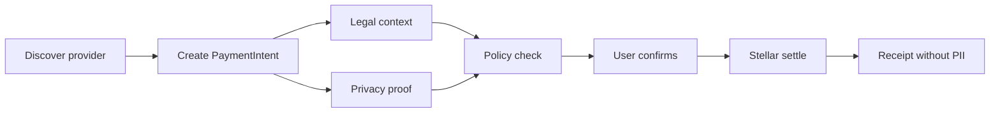
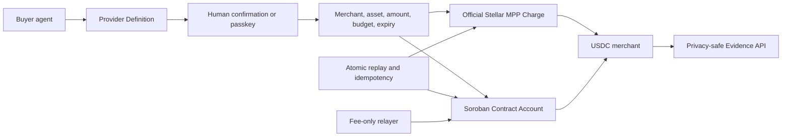

# Stellar Agent Spend Hub

**Privacy-first agentic payments on Stellar for MCP/API and digital-service spend.**

Stellar Agent Spend Hub lets an AI agent discover paid resources, prepare a payment intent, evaluate legal/privacy/policy rules, ask the user to confirm, settle through a Stellar-first rail, and leave an auditable receipt without exposing PII or secrets.

[Live demo](https://agente-pagos-stellar.vercel.app) | [Public evidence](https://agente-pagos-stellar.vercel.app/api/evidence) | [First testnet transaction](https://horizon-testnet.stellar.org/transactions/4ebf30f6a9492f09739cbb5dd2710766f5a520097f2100e14e2918dd633d97bb) | [Docs](./docs/README.md)


## Why This Exists

Agents are starting to buy things: MCP tools, APIs, browser sessions, cloud credits, data, software, reservations, and later real-world bills. The hard part is not only moving money. It is controlling what the agent can do, proving why a payment happened, and keeping private identifiers out of receipts, memos, logs, and metadata.

The v1 wedge is **MCP/API payments** because it is universal, fast to demo, low-PII, and aligned with HTTP 402, x402, MPP, and agentic commerce. LatAm bill pay remains a major roadmap wedge, but only after stronger privacy/ZK and partner integrations.

## What Works Now

- Live dashboard with read-only Live Evidence and Replay Demo modes.
- Official Stellar MPP Charge seller for a paid Stellar Risk API.
- Provider Kit V1 for Node/MCP services that want to charge in Stellar testnet USDC.
- Official MCP SDK server for provider discovery, idempotent intent creation, payment preparation, status, and sanitized receipts.
- Remote MCP Provider Pilot with bearer authentication, tenant-scoped Upstash state, one-time human approval, and a local-only buyer.
- Independent [Merchant Lab](https://stellar-agent-merchant-lab.vercel.app) with MCP quotes, MPP challenges, LCP terms, adversarial scenarios, delivery, receipts, and replay rejection.
- Passkey-owned Soroban Contract Account with a bounded Ed25519 agent session.
- Verified Contract Account fixture E2E: P-256 grant, bounded Ed25519 payment, owner revoke, and exact merchant balance delta ([public result](./docs/contract-account-fixture-result.md)).
- Ten-minute passkey deployment ceremonies with production RP/origin binding, one-time admin claim, and no raw credential ID in transit.
- Policy controls for merchant, asset, per-payment amount, cumulative budget, expiry, revoke, and replay.
- Two verified `0.01 USDC` proofs: official Stellar MPP and a passkey-managed Contract Account session payment.
- Public Evidence API with normalized amounts, lifecycle hashes, replay status, and no fabricated evidence.
- Three verified XLM testnet foundations: direct payment, policy-controlled SAC transfer, and guarded runtime settlement.
- Privacy guard blocking RUTs, phone numbers, emails, account data, card data, secrets, signatures, full XDR, and credential IDs from public receipts.
- Vercel production, Upstash atomic storage, Horizon, and Soroban RPC diagnostics.
- Human confirmation remains mandatory and every submit gate is closed by default.
- Eight focused routes with lazy page modules, route-specific API loading, deep-link support, and a responsive navigation shell.
- Stellar-first multichain control plane with ProviderDefinition v2, exact base-unit math, deterministic routing, Base x402 and supervised CCTP adapters.
- Official Privy Core JS integration for a separate user-controlled EVM authority; no wallet simulation or signing material in app state.
- Client-only static builds; server modules and payment adapters are no longer published as browser assets.

## Application Routes

| Route | Purpose | Primary API |
| --- | --- | --- |
| `/` | Product thesis and coordinated proof | `GET /api/overview` |
| `/spend` | Intents, policy, review, proof, approval, receipts | `GET /api/spend` |
| `/providers` | Directory, search, intent creation, Provider Kit | `GET /api/providers` |
| `/mpp` | Stellar MPP seller, resource, receipts | MPP endpoints |
| `/wallet` | Passkey owner and bounded Stellar Contract Account session | Contract Account endpoints |
| `/treasury` | Privy EVM authority, multichain routing, Base x402 and CCTP | Multichain endpoints |
| `/evidence` | Live/Replay evidence and diagnostics | `GET /api/overview` |
| `/security` | Privacy, LCP, ZK demo, Labs and LatAm roadmap | Compatibility state |

Routes use the History API and support direct reloads locally and on Vercel.

## Stellar-First Multichain

The new control plane discovers payment options across networks while preserving Stellar as the primary trust layer. Provider definitions can advertise Stellar MPP, Stellar Contract Account or Base x402 options. Quotes compare compatible assets, policy, network gates and per-network balances; Stellar wins equal scores.

Base Sepolia execution is pinned to official testnet USDC and an allowlisted merchant. Avalanche Fuji is registered for wallet/readiness work but submit is hard-disabled. CCTP Base-to-Stellar is a separate supervised `BridgeIntent` fixed to `1 USDC`; it can never run automatically because a payment lacks balance.

The code paths and Treasury UI are implemented. Real Base x402 and CCTP hashes remain pending a supervised Privy/funding acceptance session, and the frozen SCF Stellar evidence is unchanged. [Multichain architecture and runbook](./docs/sprint-21-23-multichain.md)

## MCP Agent Interface

The local MCP server exposes five bounded tools through the official TypeScript SDK: provider discovery, intent creation, payment preparation, status, and receipt lookup. It does not expose `execute_payment`; every prepared payment links back to `/spend?intent=<id>` for explicit human approval.

```powershell
npm run mcp:serve
npm run mcp:test
```

The MCP boundary fixes the demo maximum at `0.01 USDC`, requires idempotency, validates inputs with Zod, returns structured content, and applies the same privacy firewall used by public receipts. [MCP server guide](./docs/mcp-server.md)

The Sprint 20 pilot additionally exposes authenticated stateless Streamable HTTP at `POST /api/mcp`. Its tools create and prepare a fixed Merchant Lab `0.01 USDC` draft, while settlement remains exclusively in `npm run pilot:buyer`. [Provider Pilot runbook](./docs/sprint-20-provider-pilot.md)

## Machine Payment Proof

The official Stellar MPP seller quotes exactly `0.01 USDC` testnet for a Horizon-backed Stellar Risk API. Production has returned a valid `stellar/charge` challenge and Upstash provides atomic replay protection. The buyer remains local so its key never enters the browser, repository, or Vercel.

The official MPP settlement is verified at `0.01 USDC`: [`8290da7e...985836`](https://stellar.expert/explorer/testnet/tx/8290da7e4da419d824f49da6a8ad21fb7e5117cccf861c923dc21e299e985836). The paid resource was delivered and an identical replay was rejected.

## Sprint 10: Passkey Contract Account

`SpendAccountV1` implements `__check_auth` with two authorization paths: a WebAuthn/secp256r1 owner for grants and recovery, and an Ed25519 agent session restricted to the merchant, testnet USDC, `0.01 USDC` per payment, `0.02 USDC` total and 24-hour expiry.

The Wasm is installed on testnet with hash `6230e90601a82fd1afd8ae3dd59da55a4bc66d5e1fd4603996b1466f88c3c800`. [Verify the upload transaction](https://stellar.expert/explorer/testnet/tx/e03bcebf3ba684d4cff805cd2f990722e92c07881e159a13d93f6204b8aa8d80).

The merchant and relayer are deliberately separate. The relayer holds no USDC and can only pay network fees. A production-domain passkey deployed the live Contract Account, granted the bounded session, and authorized the session payment. The `0.01 USDC` payment is verified at [`b37ab921...6af094`](https://stellar.expert/explorer/testnet/tx/b37ab9217c108b023abcb3905d4fee98d32999b23d800c9471f82aeb646af094).

[Sprint 10 status and acceptance gates](./docs/sprint-10-contract-account.md)

## Sprint 14-16: SCF Package and Acceptance Gate

The public package now includes:

- a decision-complete SCF Build application for a `$75,000` request across four milestones;
- an English 90-second demo script, storyboard, and pitch-deck narrative;
- a Spanish executive summary and talking points;
- a versioned Evidence API used by the dashboard as the public source of truth;
- a supervised acceptance runbook for the two coordinated USDC settlements.

The application is packaged but **must not be submitted** until both coordinated payments are verified:

1. MPP G-account pays `0.01 USDC` to the merchant.
2. Passkey-managed Contract Account session pays `0.01 USDC` under policy.

[SCF application](./docs/scf-application.md) | [Spanish summary](./docs/scf-executive-summary-es.md) | [Acceptance runbook](./docs/scf-acceptance-runbook.md) | [Demo storyboard](./docs/demo-storyboard.md)

## First Verified Testnet Payment

The project has already executed one tiny payment from Vercel to Stellar testnet.

| Field | Value |
| --- | --- |
| Transaction hash | `4ebf30f6a9492f09739cbb5dd2710766f5a520097f2100e14e2918dd633d97bb` |
| Horizon | https://horizon-testnet.stellar.org/transactions/4ebf30f6a9492f09739cbb5dd2710766f5a520097f2100e14e2918dd633d97bb |
| Amount | `0.0000010 XLM` |
| Network | `stellar:testnet` |
| Rail | `Stellar Testnet Real Rail` |
| Finality | `submitted-testnet` |
| Source public key | `GDHVLS4D76CFR4OLJWFHYYKWC526QLTGADBNLUII5QG6XS2QM4VY4WC5` |
| Destination public key | `GAJHUKKQVK3OKUAAJ3GTE2U7BWSM4L7JY7CLMRFHJ4S2Z7HEN5L7NHPX` |

`STELLAR_SUBMIT_ENABLED` is back to `false` in production. Any new real testnet submit must be explicitly opened, deployed, executed once, closed, and redeployed.

## Product Flow




## First Soroban Smart Wallet Testnet Contract

Sprint 05 deployed and invoked the permission wallet on Stellar testnet.

| Field | Value |
| --- | --- |
| Contract | `CAVI7DRQOWYNH2DD6DF53LXGCFEORVVEVWKZCCR3TCAHZLNRSQNONCYQ` |
| Lab | https://lab.stellar.org/r/testnet/contract/CAVI7DRQOWYNH2DD6DF53LXGCFEORVVEVWKZCCR3TCAHZLNRSQNONCYQ |
| Execute proof | https://stellar.expert/explorer/testnet/tx/c1d10a147ec9ad8c97f16675354eb8f8a7375c9aeba6a01d371402014d9aaf87 |
| Behavior | owner grant -> session signer execute -> public policy read |

Sprint 06 extends this proof toward native XLM SAC transfers behind the same permission layer.

## First SAC Transfer Behind Policy

Sprint 06 moved native XLM testnet through the Stellar Asset Contract from the smart wallet contract after owner/session, provider, destination, asset, limit, expiry and nonce checks passed.

| Field | Value |
| --- | --- |
| Smart wallet contract | `CDJEHJ763TTIVHD3MMFWIKO3R2K3A6MJKWZFZDU2L6LXXKEU43CDIGZU` |
| Native SAC | `CDLZFC3SYJYDZT7K67VZ75HPJVIEUVNIXF47ZG2FB2RMQQVU2HHGCYSC` |
| Transfer proof | https://stellar.expert/explorer/testnet/tx/8d9810cde8839895cd421756115df3de4b9f8e56f2460076a439b318e0b3ba7f |
| Behavior | pre-funded contract -> policy check -> SAC transfer -> TransferExecutedEvent |

This is still testnet-only and tiny; USDC/mainnet and bill pay remain out of scope.
## Guarded Runtime Settlement

Sprint 08 connected the backend payment lifecycle to the Soroban transfer path with admin auth, explicit submit gates, tiny limits, idempotency and safe receipts.

| Field | Value |
| --- | --- |
| Runtime proof | https://stellar.expert/explorer/testnet/tx/cb9bf9fcef3a79d045285b9c82a2633d8e78f36e9625fd6fb46ab799aae7152e |
| Horizon result | `successful: true`, ledger `3300195` |
| Receipt | `settled`, `soroban-testnet-submit`, nonce `3` |
| Safety | ephemeral admin token; submit gate closed after execution |
## Architecture



The two payment paths are intentionally separate in this phase. They share provider discovery, policy language, sanitized receipts, and public verification, but they do not share signing authority.

## Why Stellar

- Stellar is credible for stablecoin and low-cost payment rails.
- Testnet plus `@stellar/stellar-sdk` already produced a verifiable settlement hash.
- Soroban gives a path to smart wallets, session keys, limits, allowlists, and policy signer patterns.
- Stellar is a strong ecosystem fit for grants and LatAm utility.
- The product can remain Stellar-first while staying compatible with x402/MPP-style discovery and challenge flows.

## Why MCP/API First

- Easier to validate than IRL bill pay because it avoids RUT, customer numbers, addresses, and account identifiers.
- Better demo loop: an agent requests a resource, receives `402 Payment Required`, pays, retries, and gets the resource.
- Natural early buyers: MCP providers, API companies, AI infra tools, data providers, cloud/devtool vendors.
- Lets the project prove control, privacy, receipts, and settlement before entering regulated bill-pay workflows.

## Quickstart

```powershell
npm install
npm run qa
npm run dev
```

Open:

```text
http://localhost:4179
```

Useful commands:

```powershell
npm test
npm run smoke
npm run doctor
npm run agent:402 -- --provider browserbase-mcp --resource agent-client-smoke --amount 9
npm run contract:test
npm run contract:build
npm run account:test
npm run account:build
npm run account:plan
```

## Stellar Testnet

Dry-run readiness:

```powershell
npm run setup:testnet
npm run testnet:doctor
npm run testnet:payment
```

Supervised tiny submit, only during a controlled test window:

```powershell
$env:STELLAR_SUBMIT_ENABLED="true"
npm run testnet:payment -- --execute
$env:STELLAR_SUBMIT_ENABLED="false"
```

The default amount is `0.000001 XLM`. CLIs and receipts must never print `STELLAR_SECRET_KEY` or `TESTNET_PAYMENT_ADMIN_TOKEN`.


## Soroban Testnet

Contract deploy/invoke is scripted as dry-run by default:

```powershell
npm run soroban:plan
npm run soroban:deploy
```

Only after `npm run qa:full` passes and Stellar CLI identities are funded on testnet, execute real testnet actions:

```powershell
npm run soroban:deploy:execute
npm run soroban:init -- --execute
npm run soroban:grant -- --execute
npm run soroban:execute -- --execute
npm run soroban:read -- --execute
```

Use CLI identities such as `spendhub-owner` and `spendhub-session`; never pass seed phrases or secret keys in command arguments.

To route local app receipts through the Soroban adapter without auto-submitting on-chain:

```powershell
$env:SPEND_HUB_PAYMENT_RAIL="soroban-dry-run"
```
## Guarded Soroban Runtime

Sprint 08 separates payment previews from real settlement:

- `soroban-dry-run` creates a pending preview receipt with no transaction hash.
- `soroban-testnet-submit` is accepted only by the admin endpoint when bearer auth, testnet lock, native SAC allowlist, tiny limit, Stellar CLI driver and submit gate all pass.
- Every operation requires an idempotency key and Soroban nonce.
- Missing or ambiguous transaction hashes never produce a settled receipt.

```powershell
npm run soroban:admin-transfer
npm run soroban:admin-submit
```

The Vercel function remains suitable for guarded dry-runs. Real CLI submission must run on a trusted machine with the Stellar CLI identity until an audited SDK signing boundary is implemented.

## Vercel Deploy

Project: `agente-pagos-stellar`
Production: <https://agente-pagos-stellar.vercel.app>

```powershell
npm run qa:full
vercel build --prod
vercel deploy --prebuilt --prod --yes
```

Secrets are stored only as sensitive Vercel environment variables. Submit gates remain `false` outside a supervised acceptance window. Never commit `.env`, `.env.*`, `.vercel`, runtime state, build output, logs, assertions, or secret outputs.

## Documentation

- [SCF application](./docs/scf-application.md)
- [Resumen ejecutivo SCF](./docs/scf-executive-summary-es.md)
- [SCF pitch deck narrative](./docs/scf-pitch-deck.md)
- [90-second demo script](./docs/demo-script.md)
- [Demo storyboard](./docs/demo-storyboard.md)
- [USDC acceptance runbook](./docs/scf-acceptance-runbook.md)
- [Public evidence contract](./docs/public-evidence.md)
- [Threat model](./docs/threat-model.md)
- [Provider Kit](./docs/provider-kit.md)
- [MCP agent interface](./docs/mcp-server.md)
- [Current state](./docs/current-state.md)
- [Architecture](./docs/architecture.md)
- [Historical documentation index](./docs/README.md)

## V1 Rules

- User confirms every real payment.
- Autopilot is blocked in v1.
- The agent never receives private keys, card data, bank credentials, or raw bill-pay identifiers.
- Bill pay LatAm remains roadmap until the privacy layer and partnerships are stronger.
- DeFi actions stay simulated/blocked until contracts and strategy risks are reviewed.

## Submission Readiness

| Area | State |
| --- | --- |
| JavaScript tests | `141/141` passing |
| Rust tests | `31/31` passing |
| XLM testnet foundations | 3 verified public settlements |
| Official MPP challenge | Verified in production |
| MPP USDC settlement | Verified `0.01 USDC` |
| Spend Account V1 | Human passkey instance deployed and funded |
| Contract Account USDC settlement | Verified `0.01 USDC`; replay rejected |
| Vercel / Upstash / Horizon / RPC | Operational |
| SCF package | Evidence complete; final freeze and media QA in progress |

No mainnet, production autopilot, production ZK, or LatAm bill pay is enabled.
