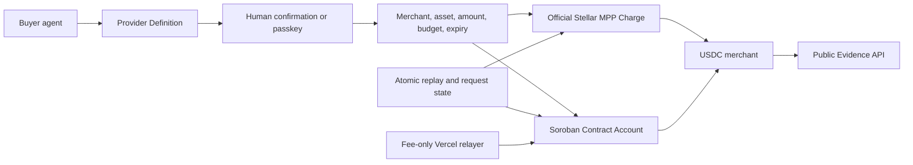

# Architecture

## Trust flow

Stellar Agent Spend Hub is a control and verification layer for agentic spending:

`Discover -> Authorize -> Policy -> Settle -> Verify`

## Two coordinated payment paths

### Official MPP Charge

A local buyer requests the Stellar Risk API, receives a standards-based `402` challenge, validates recipient, network, asset, and the `0.01 USDC` maximum, then asks for explicit confirmation. Upstash atomically consumes the paid request before the resource and receipt are returned.

### Soroban Contract Account

A WebAuthn passkey owns the account and can grant or revoke an Ed25519 agent session. The session can authorize only the configured USDC SAC transfer to the merchant under its per-payment limit, cumulative budget, and expiry. A separate relayer pays network fees and never receives user funds.

The paths intentionally remain separate. The current MPP buyer uses a classic G-account keypair, while the Contract Account uses Soroban authorization entries. They share provider definitions, policy semantics, sanitized receipts, and public evidence.

## Main components

- `ProviderKit`: validates machine-readable provider definitions and the paid-resource lifecycle.
- `MppChargeService`: official Stellar MPP seller for the Horizon-backed risk report.
- `SpendAccountV1`: contract account implementing passkey owner and bounded session authorization.
- `ContractAccountRelayer`: reconstructs canonical allowlisted calls and rejects arbitrary XDR.
- `PublicEvidenceService`: publishes verified and explicitly pending evidence.
- `SensitiveDataGuard`: blocks PII, secrets, signatures, XDR, and credential identifiers.
- `Upstash`: atomic replay protection, request state, idempotency, and sanitized receipts.
- `Horizon` and `Soroban RPC`: transaction lookup, simulation, submission, and verification.

## Security boundaries

- Buyer and session secrets remain local and never enter the browser or public repository.
- Relayer secret stays in sensitive Vercel environment variables.
- Browser handles WebAuthn but never receives relayer or buyer secrets.
- The relayer accepts semantic actions, never arbitrary transaction envelopes.
- Every public evidence panel is read-only and returns `executionAllowed=false`.
- Submit gates are closed by default and reopened only during supervised testnet acceptance.

## Deferred scope

Mainnet, autonomous production spending, MPP Session, production ZK, and LatAm bill pay are deferred until external review, operational controls, and provider validation are complete.