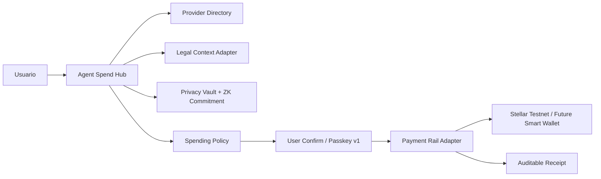

# Arquitectura

## Modelo general

El sistema opera como un Spend Hub: un agente descubre proveedores, crea intents, evalua policy/legal/privacy, pide confirmacion del usuario y liquida por un rail. En v1 el rail funcional de demo es Stellar simulado; el rail real Stellar testnet ya existe como frontera controlada.

## Flujo interno

1. Discover: buscar proveedor, endpoint, categoria, metodo de pago y contexto legal.
2. Privacy Proof: verificar que no haya PII publica y, si aplica, generar commitment/proof demo.
3. Policy Check: limites, allowlists, asset permitido, riesgo, slippage y confirmacion requerida.
4. User Confirm: en v1 siempre requiere aprobacion humana.
5. Stellar Settle: preparar o ejecutar rail y emitir recibo auditable.

## Componentes actuales

- `SpendHubService`: orquestador de intents, proofs, receipts, directory y approvals.
- `ProviderDirectoryAdapter`: discovery tipo Stripe Directory/MPP.
- `LegalContextAdapter`: evalua LCP, terms hash, trust level y acceptance required.
- `PrivacyVaultAdapter`: simula almacenamiento de secretos como sealed refs.
- `ZkCommitmentAdapter`: commitments/proofs demo sin revelar identificadores.
- `StellarTestnetAdapter`: rail simulado para demo local.
- `StellarTestnetRealAdapter`: rail testnet real con SDK, dry-run por defecto y submit gate.
- `MachinePaymentAdapter`: flujo HTTP 402 con challenge, credential y retry.
- `LinkAgentWalletAdapter`: simulacion de Link/SPT como benchmark fiat futuro.
- `CircleX402Adapter` y `TempoAdapter`: benchmarks/future rails, no dependencias v1.

## Entidades clave

- `Provider`: servicio que puede vender recurso digital, accion crypto o bill pay.
- `PaymentIntent`: propuesta de pago con monto, proveedor, rail, privacy requirement y razon del agente.
- `SpendingPolicy`: limites y reglas del usuario.
- `PaymentReceipt`: evidencia auditable sin PII.
- `Proof`: commitment/proof demo asociado a un secreto privado.

## Rails

### Stellar simulado

Usado por el demo local. Permite mostrar UX, receipts, policy y 402 sin depender de fondos reales.

### Stellar testnet real

Usa `@stellar/stellar-sdk`, valida env vars y keypair, prepara pago tiny y solo ejecuta si:

- `STELLAR_SUBMIT_ENABLED=true`
- se llama `npm run testnet:payment -- --execute`
- policy permite el intent
- env vars estan completas
- keypair es valido

### Future rails

- Stellar smart wallet/Soroban con session keys, limits, policy signer y passkeys.
- MPP/x402 compatible para recursos digitales.
- Link-like fiat wallets para mercados donde sea viable.
- Tempo/Circle como referencias competitivas, no cambio de rumbo.

## Decision importante

El rail activo de producto sigue siendo Stellar-first. Otros protocolos se usan para aprender patrones de mercado y compatibilidad, no para abandonar la narrativa Stellar.
