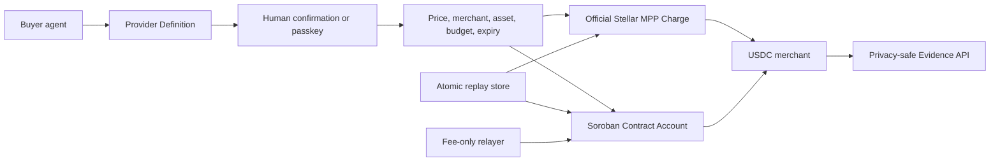

# Stellar Community Fund Build Application

## Project

**Name:** Stellar Agent Spend Hub
**Category:** Infrastructure and Services / Payments
**Requested funding:** USD 75,000 equivalent in XLM
**Target track:** SCF Build Open track
**Submission gate:** Do not submit until both coordinated USDC testnet settlements are verified.

## One-line pitch

Stellar Agent Spend Hub lets AI agents pay for APIs in USDC while users retain control through passkeys, bounded session permissions, and privacy-safe public receipts.

## Executive summary

AI agents can already discover tools and invoke APIs, but they cannot safely receive broad wallet authority. API providers also lack a simple path from discovery to verifiable payment that does not expose card data or personal identifiers. Stellar Agent Spend Hub combines two complementary Stellar-native capabilities:

1. An official MPP Charge flow where a local buyer agent pays `0.01 USDC` to unlock a Horizon-backed Stellar Risk API.
2. A Soroban contract account where a passkey owner grants a bounded Ed25519 agent session that can pay only one merchant, in one asset, under per-payment, cumulative-budget, and expiry limits.

The project is testnet-only. Three XLM settlements are already publicly verified. The coordinated USDC settlements remain explicitly pending Circle Faucet funding and a production-domain passkey ceremony. No simulated hash is presented as evidence.

## Problem

Agent wallets commonly force users into one of two bad choices:

- approve every low-value request manually, eliminating useful automation;
- give an agent broad custody or payment authority, creating unacceptable loss and replay risk.

Providers face a second problem. Metered APIs and MCP services need an interoperable way to quote a resource, receive payment, deliver it, and issue a receipt. Existing payment rails solve settlement, but rarely combine provider discovery, bounded agent authority, privacy controls, and public evidence.

## Initial users and market entry

### Primary users

- MCP and API providers selling data, browser sessions, inference, search, or developer resources;
- AI-agent developers who need controlled machine spending;
- crypto-native power users testing delegated USDC payments.

### Initial wedge

MCP/API payments are the first wedge because delivery is instant, pricing is machine-readable, and the transaction can avoid RUTs, customer numbers, addresses, or card credentials. Privacy-first LatAm bill pay remains a later expansion, after secure vault, proof, legal, and partner requirements are met.

### Who pays

The first commercial customer is the API provider. The proposed model is a low monthly platform fee plus a transparent fee on successfully settled agent payments. During the grant period, provider interviews and one sandbox integration will validate pricing before mainnet activation.

## Solution

The product follows one trust flow:

`Discover -> Authorize -> Policy -> Settle -> Verify`

- **Discover:** a structured Provider Definition exposes endpoint, resource, price, asset, network, legal context, and privacy requirements.
- **Authorize:** MPP requires explicit local confirmation; the contract account requires a passkey owner to create or revoke a session.
- **Policy:** the system fixes merchant, testnet USDC, maximum price, per-payment limit, cumulative budget, and expiry.
- **Settle:** Stellar MPP or the Soroban contract account performs the testnet settlement.
- **Verify:** the public Evidence API exposes only network, asset, amount, policy summary, transaction hash, and explorer URL.

## Why Stellar

- Stellar provides low-cost, fast settlement designed for payments and stablecoins.
- The official Stellar MPP SDK gives providers an interoperable machine-payment path.
- Soroban contract accounts support programmable authorization rather than handing agents unrestricted wallet keys.
- Stellar Asset Contracts provide a consistent token interface for XLM and USDC.
- Public testnet transactions make technical progress independently verifiable.
- Stellar has a strong fit with the long-term LatAm utility thesis.

## Differentiation

| Alternative | What it solves | Remaining gap | Spend Hub contribution |
| --- | --- | --- | --- |
| Traditional wallet | User custody and transfers | No bounded agent workflow | Passkey owner plus limited agent session |
| x402/MPP integration alone | Payment challenge and settlement | No user policy or contract-account control | Discovery, policy, receipts, and programmable authorization |
| Custodial agent wallet | Fast autonomous spending | Broad custody and platform trust | User-controlled account and revocable session |
| Card-based agent payment | Fiat merchant coverage | PCI, geography, and closed credentials | Open Stellar settlement and public verification |
| Generic smart wallet | Programmable account | No provider monetization flow | Provider Kit plus MPP paid-resource lifecycle |

## Architecture

MPP and the contract account intentionally remain separate in this phase because the current MPP buyer path uses a classic Stellar keypair. A future milestone may connect MPP to contract-account authorization after the independent proofs are stable and reviewed.

## Current implementation and evidence

### Verified

- Live application: <https://agente-pagos-stellar.vercel.app>
- Public evidence manifest: <https://agente-pagos-stellar.vercel.app/api/evidence>
- Direct Stellar testnet settlement: `4ebf30f6a9492f09739cbb5dd2710766f5a520097f2100e14e2918dd633d97bb`.
- Policy-controlled native SAC transfer: `8d9810cde8839895cd421756115df3de4b9f8e56f2460076a439b318e0b3ba7f`.
- Guarded Soroban runtime settlement: `cb9bf9fcef3a79d045285b9c82a2633d8e78f36e9625fd6fb46ab799aae7152e`.
- Spend Account V1 Wasm uploaded to testnet.
- Production MPP endpoint returned an official `402` challenge for exactly `0.01 USDC`.
- An official MCP SDK server exposes bounded discovery, intent, preparation, status, and receipt tools without settlement authority.
- A separately deployed Merchant Lab provides an independent seller boundary, public LCP, adversarial buyer tests, stateless simulated receipts, and replay rejection.
- Upstash, Horizon, Soroban RPC, and Vercel production diagnostics are operational.
- `115/115` JavaScript tests and `31/31` Rust tests pass through the full QA pipeline.

### Pending submission gate

- One real `0.01 USDC` MPP settlement and replay rejection.
- Production-domain passkey registration and Spend Account V1 deployment.
- One policy-controlled `0.01 USDC` contract-account settlement.

Pending entries have no transaction hash or explorer URL. The application is packaged now but will not be submitted until both USDC proofs are public.

## Milestones, timeline, and budget

| Milestone | Weeks | Deliverables | Acceptance criteria | Budget |
| --- | ---: | --- | --- | ---: |
| 1. Testnet Trust Demo | 1-4 | Coordinated MPP and contract-account payments, public evidence, replay demo | Two verified `0.01 USDC` hashes; gates closed after acceptance | $12,000 |
| 2. Provider Kit Pilot | 5-10 | Node/MCP kit, provider schema, integration docs, design-partner discovery | Three provider interviews and one sandbox integration | $18,000 |
| 3. Security and Beta | 11-18 | External review, recovery/session hardening, monitoring, supervised beta | Security report, 20 testers, 100 successful testnet payments, zero PII receipts | $25,000 |
| 4. Mainnet Readiness | 19-24 | Audit remediation, incident runbook, operational controls, launch assessment | Documented go/no-go decision; no mainnet activation before controls pass | $20,000 |
| **Total** | **24** |  |  | **$75,000** |

### Budget rationale

- Engineering and protocol integration: $42,000.
- Security review and remediation: $16,000.
- Provider pilot, developer documentation, and support: $9,000.
- Infrastructure, monitoring, testing, and contingency: $8,000.

Funds are milestone-based. Mainnet launch is not an automatic grant deliverable; the final milestone produces the evidence and controls required for a responsible decision.

## Success metrics

- MPP challenge-to-settlement conversion.
- Successful and policy-blocked payments by reason.
- Duplicate or replay attempts accepted: target `0`.
- Public receipts containing PII or secrets: target `0`.
- Median provider integration time: target under one working day by Milestone 2.
- Three provider interviews and one sandbox provider integration.
- Twenty supervised beta users and 100 successful testnet payments.
- Settlement availability and median latency published in diagnostics.

## Distribution and ecosystem impact

1. Publish the Provider Kit and a complete paid Node/MCP example.
2. Interview Stellar, MCP, data, browser automation, and AI infrastructure providers.
3. Integrate one design partner in a sandbox before seeking mainnet volume.
4. Use public evidence and policy-block statistics to improve the developer contract.
5. Expand toward digital services, then privacy-first LatAm bill pay only after security and partner gates pass.

The project creates new Stellar demand from machine-priced digital resources and gives providers a reusable path to accept USDC without building agent authorization from scratch.

## Security and privacy

- No browser or server response exposes private keys, signatures, full XDR, credential IDs, RUTs, emails, phone numbers, account numbers, or customer references.
- The relayer reconstructs allowlisted calls and never accepts arbitrary transaction XDR.
- Contract sessions are constrained by merchant, asset, amount, cumulative budget, and expiry.
- Upstash provides atomic request consumption and idempotency.
- Public evidence is read-only; Replay Demo never signs or submits.
- Every production submit gate is closed by default and closed again after supervised acceptance.

## Risks and mitigations

| Risk | Mitigation |
| --- | --- |
| Contract or relayer defect | Testnet-only operation, external review before mainnet, hard fee and destination limits |
| Agent key compromise | Small cumulative budget, short expiry, passkey revoke, fixed merchant and asset |
| Replay/concurrent submit | Soroban auth nonce plus atomic Upstash consumption |
| False public evidence | Pending entries cannot contain a hash, URL, or verification timestamp |
| Provider adoption risk | Interviews and one sandbox integration before larger product expansion |
| Privacy leakage | Sensitive-data guard, sanitized receipts, secret audit, no bill-pay PII in current scope |
| Infrastructure dependency | Public diagnostics, closed gates, recoverable request state, incident runbook |

## Public deliverables

- GitHub repository and technical README.
- Live read-only trust demo.
- Public Evidence and diagnostics APIs.
- Soroban contract-account source and tests.
- Official MPP seller and local buyer CLI.
- Provider Kit and paid API example.
- Threat model, acceptance runbook, and milestone reports.

## Submission readiness

SCF currently advertises Build awards of up to `$150,000` in XLM across Open, Integration, and RFP tracks. The current SCF #45 page lists a July 26, 2026 submission deadline and asks interested teams to submit the interest form as soon as possible. Requirements and dates must be checked again on submission day:

- <https://communityfund.stellar.org/>
- <https://communityfund.stellar.org/awards>

Private team biographies, legal identity, payout information, and final form-specific answers are supplied directly through the SCF application and are not stored in this public repository.
