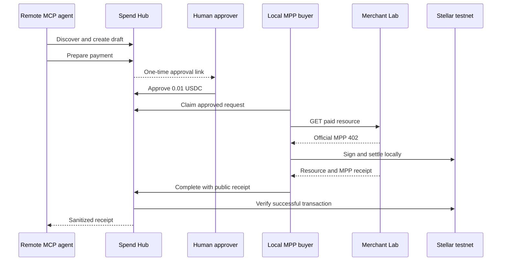

# Sprint 20: Remote MCP Provider Pilot

## Status

Implementation complete locally. The remote gate remains closed until a supervised
testnet acceptance session.

## Flow



The remote MCP server never exposes an execution tool and never receives a buyer
secret. The approval link changes request state only. Settlement is performed by
the supervised local buyer.

## Interfaces

- `POST /api/mcp`: authenticated stateless MCP Streamable HTTP.
- `GET /api/pilot/readiness`: public gate and persistence readiness.
- `GET /api/pilot/requests/:requestId`: public immutable proposal.
- `POST /api/pilot/requests/:requestId/approve`: one-time human approval.
- `POST /api/pilot/requests/:requestId/claim`: authenticated buyer claim.
- `POST /api/pilot/requests/:requestId/complete`: authenticated verified completion.
- `GET /api/pilot/evidence`: sanitized post-SCF pilot evidence.

Remote tools:

- `discover_providers`
- `create_payment_draft`
- `prepare_payment`
- `get_payment_status`
- `get_receipt`

There is no `execute_payment` tool.

## Configuration

Private Vercel variables:

- `MCP_PILOT_API_KEY_HASH`: SHA-256 of the raw pilot key.
- `MCP_PILOT_APPROVAL_SECRET`: at least 32 random characters.
- Upstash credentials already supported by the project.

Public server-side configuration:

- `MCP_PILOT_ENABLED=false`
- `MCP_PILOT_MERCHANT_RECIPIENT=<testnet G-account>`
- `MCP_APP_BASE_URL=https://agente-pagos-stellar.vercel.app`

Local buyer variables:

- `MCP_PILOT_API_KEY`: raw key, local process only.
- `MPP_BUYER_IDENTITY=spendhub-owner` or temporary `MPP_BUYER_SECRET`.
- `MCP_PILOT_BASE_URL=https://agente-pagos-stellar.vercel.app`

Never store the raw API key, buyer secret, approval token, signatures, or XDR in
Vercel logs, docs, receipts, screenshots, or committed files.

## Acceptance Runbook

1. Confirm Merchant Lab official MPP readiness and its `0.01 USDC`
   `stellar-risk-snapshot` resource.
2. Configure the pilot key hash, approval secret, merchant recipient, and
   `MCP_PILOT_ENABLED=false`.
3. Deploy and verify `/api/pilot/readiness`.
4. Temporarily set `MCP_PILOT_ENABLED=true` and redeploy.
5. Connect an MCP Streamable HTTP client with the bearer key.
6. Create and prepare an idempotent draft.
7. Open the returned `/spend?pilot=...#approval=...` URL and approve it.
8. Run:

   ```powershell
   npm run pilot:buyer -- --request <requestId>
   ```

9. Type `CONFIRM` after checking provider, recipient, asset, network, and price.
10. Verify the transaction hash through `/api/pilot/evidence` and Stellar Expert.
11. Confirm a second claim or completion returns `409`.
12. Set `MCP_PILOT_ENABLED=false` and redeploy.

If the provider or Stellar RPC fails, no settled receipt is emitted. A claim
lease expires after two minutes so the supervised buyer can retry safely.

## Security Boundaries

- One tenant: `merchant-lab-reference`.
- One allowlisted provider and one allowlisted resource.
- Exactly `0.01 USDC` on Stellar testnet.
- 20 requests per minute per tenant/IP and 100 per tenant/day.
- Approval tokens expire after ten minutes and are consumed once.
- Claims expire after two minutes and use CAS to prevent concurrent settlement.
- Provider redirects, arbitrary hosts, mainnet, other assets, and public
  provider registration are blocked.
- `docs/scf-evidence-snapshot.json` remains frozen and is never rewritten by the
  pilot.
